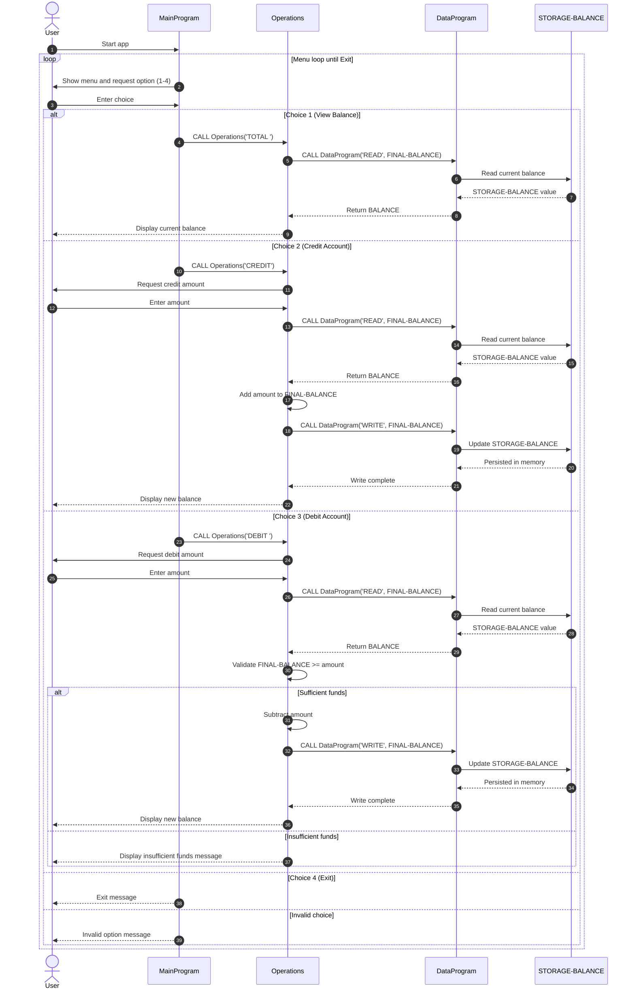

# COBOL Student Account System Documentation

## Overview

This COBOL project implements a simple student account management flow using three programs:

- `MainProgram` for user interaction and menu navigation
- `Operations` for business operations on balances
- `DataProgram` for reading/writing the account balance

The current implementation manages a single in-memory account balance, initialized to `1000.00`.

## File Purposes

### `src/cobol/main.cob`

**Program ID:** `MainProgram`

**Purpose:**
- Entry point of the application
- Displays the account menu in a loop
- Captures user choice and routes to operations

**Key behavior:**
- Menu options:
  - `1` View balance
  - `2` Credit account
  - `3` Debit account
  - `4` Exit
- Calls `Operations` with a 6-character operation code:
  - `TOTAL ` for balance inquiry
  - `CREDIT` for credit operations
  - `DEBIT ` for debit operations
- Continues until user selects Exit (`4`)

---

### `src/cobol/operations.cob`

**Program ID:** `Operations`

**Purpose:**
- Implements account transaction logic
- Coordinates with `DataProgram` to retrieve and persist balance values

**Key functions / flows:**
- **Balance inquiry (`TOTAL `):**
  - Calls `DataProgram` with `READ`
  - Displays current balance
- **Credit (`CREDIT`):**
  - Accepts a credit amount from user input
  - Reads current balance (`READ`)
  - Adds amount to balance
  - Persists updated balance (`WRITE`)
  - Displays new balance
- **Debit (`DEBIT `):**
  - Accepts a debit amount from user input
  - Reads current balance (`READ`)
  - Validates sufficient funds
  - If valid, subtracts amount and writes updated balance
  - If invalid, displays insufficient funds message

---

### `src/cobol/data.cob`

**Program ID:** `DataProgram`

**Purpose:**
- Encapsulates account balance storage
- Exposes read/write access to the balance through linkage parameters

**Key functions / flows:**
- **`READ` operation:** moves internal `STORAGE-BALANCE` to passed `BALANCE`
- **`WRITE` operation:** updates internal `STORAGE-BALANCE` from passed `BALANCE`

**Storage model:**
- Uses working storage variable `STORAGE-BALANCE`
- Initial balance is `1000.00`
- Data is in-memory for runtime only (not persisted to file/database)

## Business Rules for Student Accounts

The following business rules are implemented in current code:

1. **Single account scope**
   - The system manages one balance value at a time.

2. **Starting balance**
   - Student account balance starts at `1000.00` when the programs initialize.

3. **Allowed operations**
   - Supported operations are balance inquiry, credit, and debit.

4. **No overdraft policy**
   - Debits are only allowed when `current balance >= debit amount`.
   - If not, transaction is rejected with an insufficient funds message.

5. **Balance update flow**
   - Every credit/debit operation reads the latest balance before calculation.
   - Successful credits/debits write the new balance back to `DataProgram`.

6. **Operation contract between programs**
   - Operation names are passed as fixed-length strings (6 chars).
   - Values must match expected operation codes exactly (`TOTAL `, `CREDIT`, `DEBIT `, `READ`, `WRITE`).

## Notes and Limitations

- No student identifier is currently used; all actions affect the same account balance.
- No validation currently blocks negative or zero transaction input values.
- Balance is not durable across runs because storage is memory-based.
- Monetary fields use fixed COBOL numeric format `PIC 9(6)V99`.

## Sequence Diagram (Data Flow)

